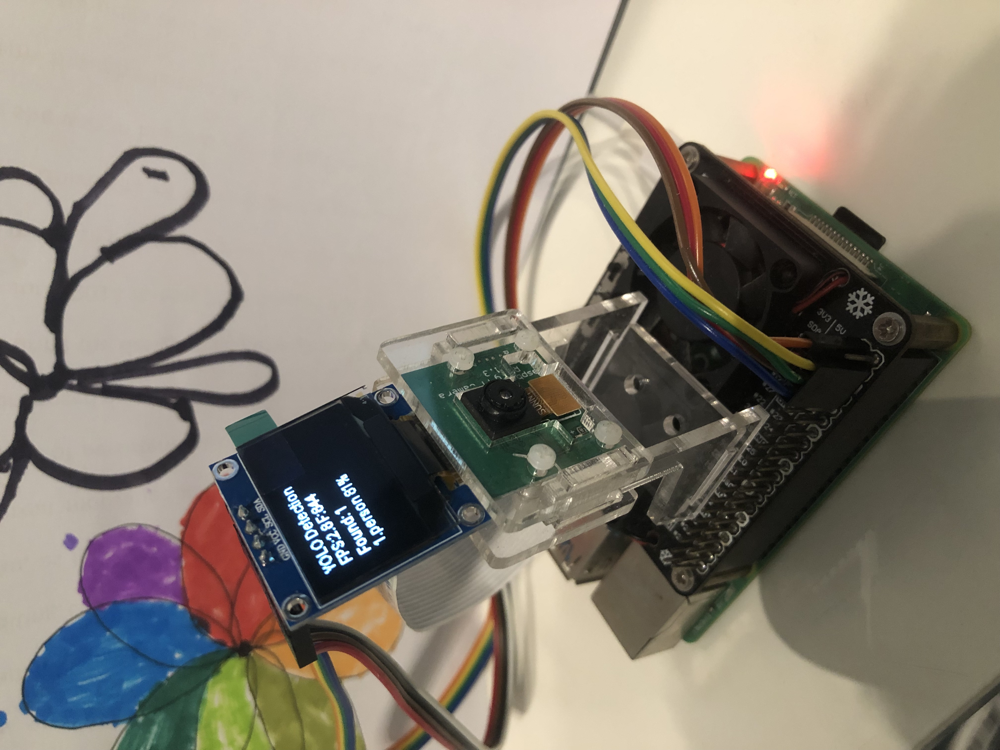

# YOLO Real-time Object Detection on Raspberry Pi

A real-time object detection system for Raspberry Pi using YOLOv11, with support for small displays (OLED/TFT/HDMI screens).




## Features

- 🚀 **YOLOv11 Powered**: Latest YOLO model optimized for edge devices
- 📹 **Real-time Detection**: Live camera feed processing
- 📺 **Multi-Display Support**: Compatible with OLED, TFT, and HDMI displays
- ⚡ **Raspberry Pi Optimized**: Efficient performance on resource-constrained devices
- 🎯 **High Accuracy**: Detects 80+ object classes with confidence scores
- 🖥️ **Flexible Output**: Console logging and visual display options

## Hardware Requirements

### Minimum Configuration
- Raspberry Pi 3B+ or newer
- Camera module or USB webcam
- 1GB RAM (2GB+ recommended)
- MicroSD card (16GB+)

### Supported Displays
- **OLED**: SSD1306 (I2C, 128x64 or 128x32)
- **TFT**: ST7789 (SPI, 240x240, 320x240)
- **HDMI**: Any HDMI-compatible small display
- **Console**: Terminal output without display

## Installation

### 1. System Setup

```bash
# Update system
sudo apt-get update
sudo apt-get upgrade -y

# Install system dependencies
sudo apt-get install -y python3-pip python3-opencv
sudo apt-get install -y libatlas-base-dev libjasper-dev libqtgui4 libqt4-test
```

### 2. Enable Hardware Interfaces

```bash
# Enable camera, I2C, and SPI
sudo raspi-config
# Navigate to: Interface Options
# Enable: Camera, I2C, SPI
```

### 3. Install Python Dependencies

```bash
# Create virtual environment (optional but recommended)
python3 -m venv yolo_env
source yolo_env/bin/activate

# Install required packages
pip install ultralytics opencv-python-headless pygame

# For OLED displays
pip install luma.oled

# For TFT displays
pip install luma.lcd
```

### 4. Download the Project

```bash
git clone https://github.com/yourusername/raspberry-pi-yolo-detection.git
cd raspberry-pi-yolo-detection
```

## Configuration

Edit the configuration section at the top of `yolo_detection.py`:

```python
# Display mode selection
DISPLAY_MODE = 'pygame'  # Options: 'pygame', 'oled', 'tft', or None

# Screen dimensions
SCREEN_WIDTH = 320
SCREEN_HEIGHT = 240

# OLED settings (if using OLED)
OLED_I2C_ADDRESS = 0x3C
OLED_WIDTH = 128
OLED_HEIGHT = 64
```

## Usage

### Basic Usage

```bash
python3 yolo_detection.py
```

### Display Mode Options

**1. Pygame Mode (HDMI Display)**
```python
DISPLAY_MODE = 'pygame'
```
Best for testing and HDMI-connected displays.

**2. OLED Mode (I2C Display)**
```python
DISPLAY_MODE = 'oled'
```
For SSD1306 OLED displays connected via I2C.

**3. TFT Mode (SPI Display)**
```python
DISPLAY_MODE = 'tft'
```
For ST7789/ST7735 TFT displays connected via SPI.

**4. Console Only**
```python
DISPLAY_MODE = None
```
Output detection results to terminal only.

## Hardware Connections

### OLED Display (I2C - SSD1306)
```
OLED VCC → Raspberry Pi 3.3V (Pin 1)
OLED GND → Raspberry Pi GND (Pin 6)
OLED SCL → Raspberry Pi GPIO 3 (Pin 5)
OLED SDA → Raspberry Pi GPIO 2 (Pin 3)
```

### TFT Display (SPI - ST7789)
```
TFT VCC → Raspberry Pi 3.3V (Pin 1)
TFT GND → Raspberry Pi GND (Pin 6)
TFT SCL → Raspberry Pi GPIO 11 (Pin 23)
TFT SDA → Raspberry Pi GPIO 10 (Pin 19)
TFT DC  → Raspberry Pi GPIO 24 (Pin 18)
TFT RST → Raspberry Pi GPIO 25 (Pin 22)
```

### Camera Module
```
Connect CSI camera to CSI port
Or use USB webcam in any USB port
```

## Performance Optimization

### For Better FPS
```python
# Reduce detection frequency
detection_interval = 10  # Detect every 10th frame

# Lower camera resolution
cap.set(cv2.CAP_PROP_FRAME_WIDTH, 320)
cap.set(cv2.CAP_PROP_FRAME_HEIGHT, 240)

# Increase confidence threshold
results = model(frame, conf=0.6, iou=0.7)
```

### For Better Accuracy
```python
# Increase detection frequency
detection_interval = 3

# Lower confidence threshold
results = model(frame, conf=0.4, iou=0.6)

# Use higher resolution
cap.set(cv2.CAP_PROP_FRAME_WIDTH, 640)
cap.set(cv2.CAP_PROP_FRAME_HEIGHT, 480)
```

## Model Variants

YOLOv13 offers multiple model sizes:

| Model | Size | Speed | Accuracy | Use Case |
|-------|------|-------|----------|----------|
| yolo13n.pt | 3.5 MB | Fastest | Good | ✅ Raspberry Pi (Recommended) |
| yolo13s.pt | 7 MB | Fast | Better | Raspberry Pi 4/5 |
| yolo13m.pt | 15 MB | Medium | Great | High-performance devices |
| yolo13l.pt | 30 MB | Slow | Excellent | GPU devices |
| yolo13x.pt | 60 MB | Slowest | Best | Server deployment |

To change model:
```python
model = YOLO('yolo13s.pt')  # Use small model
```

## Troubleshooting

### Camera Not Found
```bash
# Test camera
raspistill -o test.jpg

# Check USB cameras
ls /dev/video*

# Verify camera is enabled
vcgencmd get_camera
```

### I2C Device Not Found
```bash
# Check I2C devices
sudo i2cdetect -y 1

# Enable I2C in config
sudo raspi-config
```

### Qt Platform Plugin Error
```bash
# Install headless OpenCV
pip uninstall opencv-python
pip install opencv-python-headless
```

### Low FPS
- Reduce camera resolution
- Increase `detection_interval`
- Use `yolo13n.pt` model
- Close other applications
- Overclock Raspberry Pi (if safe)

### High CPU Usage
```python
# Add delay between frames
time.sleep(0.05)

# Reduce detection frequency
detection_interval = 15
```

## Performance Benchmarks

Tested on Raspberry Pi 4B (4GB RAM):

| Configuration | FPS | CPU Usage | Memory |
|---------------|-----|-----------|--------|
| 320x240 + interval=10 | 15 FPS | 65% | 140MB |
| 640x480 + interval=5 | 12 FPS | 75% | 150MB |
| 640x480 + interval=3 | 8 FPS | 85% | 160MB |

## Detected Object Classes

YOLOv13 can detect 80 classes including:
- **Vehicles**: car, bus, truck, bicycle, motorcycle
- **Animals**: cat, dog, bird, horse, sheep, cow
- **People**: person
- **Household**: chair, table, couch, bed, tv, laptop
- **Food**: apple, banana, pizza, sandwich, cake
- And many more...

## Output Format

### Console Output
```
[Frame 150] Detected 2 objects:
  1. person (95%)
  2. laptop (87%)

[Performance] Current FPS: 12.3
```

### Display Output
- Title: "YOLO Detection"
- FPS and frame counter
- List of detected objects with confidence
- Real-time updates

## Advanced Usage

### Custom Confidence Threshold
```python
results = model(frame, conf=0.7)  # Only show 70%+ confidence
```

### Save Detection Results
```python
# Save frame with detections
cv2.imwrite(f'detection_{frame_count}.jpg', frame)
```

### Multiple Camera Support
```python
cap = cv2.VideoCapture(1)  # Use second camera
```

## Project Structure

```
raspberry-pi-yolo-detection/
├── yolo_detection.py          # Main script
├── README.md                  # This file
├── requirements.txt           # Python dependencies
└── models/                    # Downloaded YOLO models (auto-created)
```

## Contributing

Contributions are welcome! Please feel free to submit a Pull Request.

1. Fork the repository
2. Create your feature branch (`git checkout -b feature/AmazingFeature`)
3. Commit your changes (`git commit -m 'Add some AmazingFeature'`)
4. Push to the branch (`git push origin feature/AmazingFeature`)
5. Open a Pull Request

## License

This project is licensed under the MIT License - see the [LICENSE](LICENSE) file for details.

## Acknowledgments

- [Ultralytics YOLOv13](https://github.com/ultralytics/ultralytics) - YOLO implementation
- [OpenCV](https://opencv.org/) - Computer vision library
- [Luma](https://github.com/rm-hull/luma) - Display drivers for OLED/LCD
- Raspberry Pi Foundation

## Support

For issues, questions, or suggestions:
- Open an issue on GitHub
- Check existing issues for solutions
- Refer to Ultralytics documentation

## Roadmap

- [ ] Add video recording capability
- [ ] Implement object tracking
- [ ] Add REST API for remote access
- [ ] Support for custom trained models
- [ ] Multi-threaded processing
- [ ] Web interface for configuration

## Citation

If you use this project in your research or application, please cite:

```bibtex
@software{raspberry_pi_yolo_detection,
  author = {Your Name},
  title = {YOLO Real-time Object Detection on Raspberry Pi},
  year = {2024},
  url = {https://github.com/yourusername/raspberry-pi-yolo-detection}
}
```

---

**Made with ❤️ for the Raspberry Pi community**